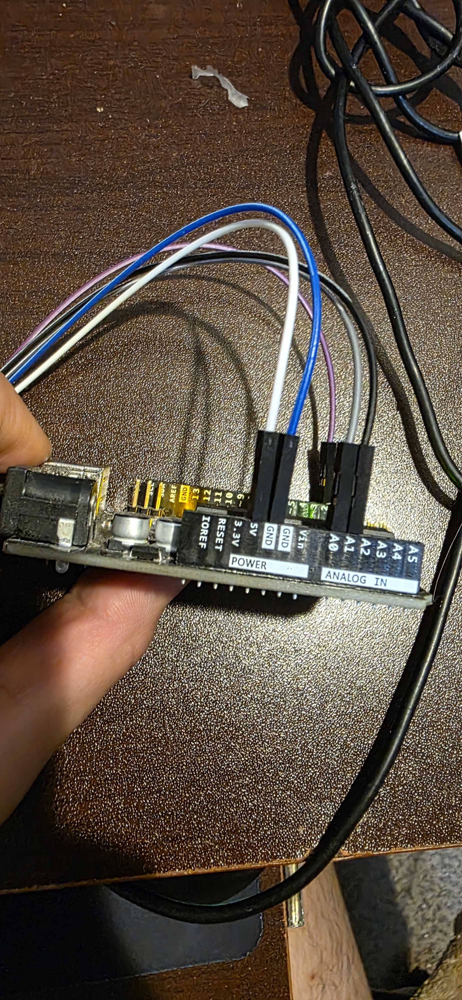
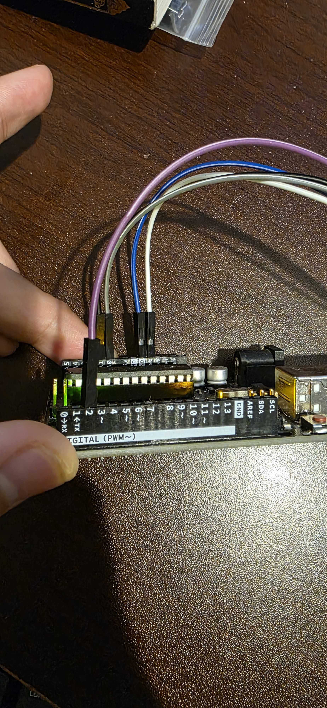
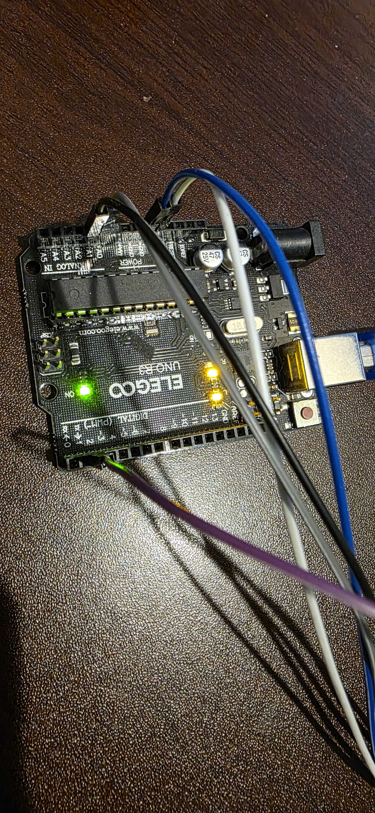
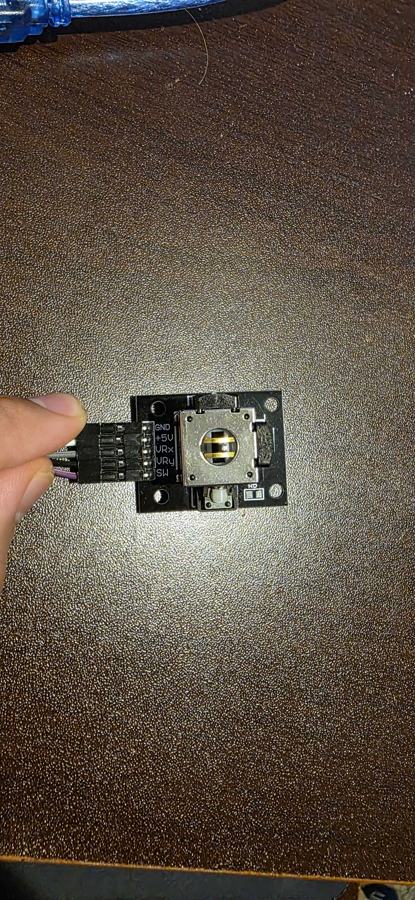

# Model-Based Embedded Fault Detection System

## Demo Videos

- Arduino IDE demo: https://youtube.com/shorts/Jpcqe5twYGc?feature=share
- Python code demo: https://youtube.com/shorts/VAUeTeP_f00?feature=share

## Current Hardware Prototype

The recorded prototype used direct jumper-wire connections from the analog joystick module to the Arduino Uno. The joystick module fed a real analog signal, and the Arduino sampled that signal on A0 in real time.

  
  

  
  

  
  
  
  

A real-hardware fault detection system: the current live prototype uses a direct-wired analog joystick module feeding an Arduino Uno on A0, with Python handling the downstream processing and classification pipeline. The repo also documents the Simscape digital twin, Stateflow fault logic, and the planned KiCad sensor front-end.

## Technical Glossary

This project uses terms from HIL testing, edge computing, DSP, power integrity, and PCB design.  
See the Jargon to English glossary here:

  

