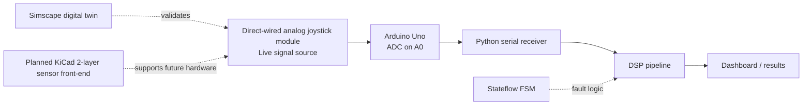

# Architecture Overview

This project is a real-hardware fault detection bench. The current recorded prototype uses a direct-wired analog joystick module as the live signal source, and the Simscape model is used as a digital twin to validate the hardware behavior and fault logic.

## System Flow

## Role Of Each Block

The physical plant in the recorded demo is a direct-wired analog joystick module connected to the Arduino Uno with jumper wires. The Arduino samples the live signal on A0 and streams timestamped CSV rows over USB serial.

The Python serial receiver is the handoff point into software. It maintains a rolling sample buffer, feeds the DSP filters, and provides the data window used by feature extraction and anomaly detection.

The DSP pipeline consumes the live buffer, extracts features, and classifies the three fault cases injected into the bench. The dashboard and results layer records the traces, detections, and runtime evidence.

The Simscape digital twin mirrors the circuit so the hardware measurements can be validated against a modeled reference. It is not the primary signal source.

## Data Flow Diagram

Physical Plant (direct-wired joystick module) -> Arduino Uno (A0 ADC) -> Python serial receiver -> DSP pipeline -> dashboard/results

## Validation Strategy

The digital twin is used to compare expected versus measured behavior, tune fault thresholds, and document design intent. Hardware results are considered the authoritative benchmark, with the model serving as a controlled reference.
